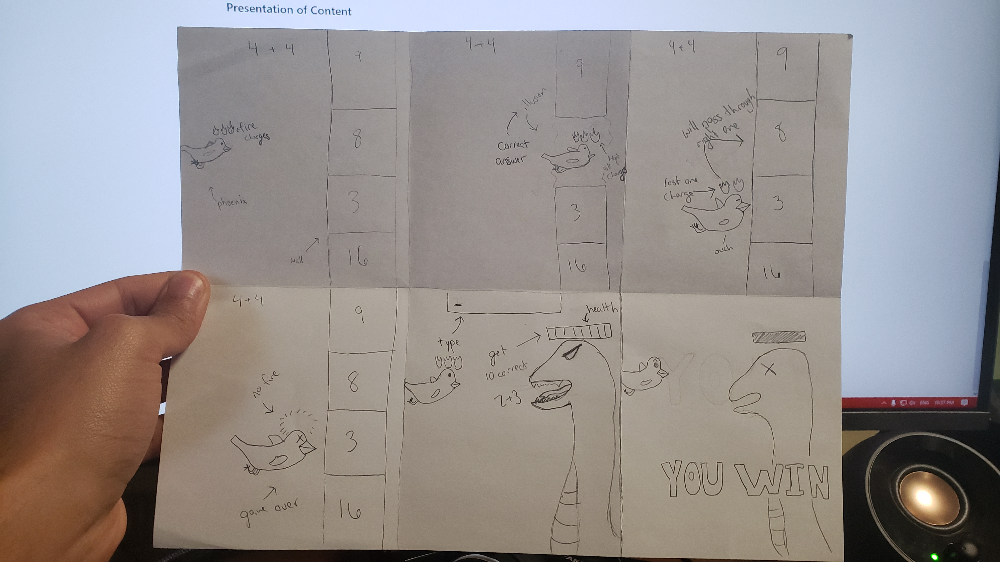

# The Legend of the Phoenix

## Elevator Pitch

*A one sentence pitch for your game. Pretend that your were pitching your game to a executive going to the elevator. You have less than 60 Seconds. Check [this resource](http://www.gameacademy.com/perfecting-indie-games-elevator-pitch/) for more information.*

You are the phoenix named Toopee who must defend the sacred cave from evil magic monsters by solving math problems.

## Influences (Brief)

- *Influence #1*:
  - Medium: Harry Potter
  - Explanation: The player is a phoenix that fights a large snake at the end. Similarly in Harry Potter, the phoenix helps harry defeat the basilisk.
- *Influence #2*:
  - Medium: *Mythical Creatures*
  - Explanation: *Phoenixes are cool so we researched on their environment and such.*

## Core Gameplay Mechanics (Brief)

*Give a very high-level description of any core gameplay mechanics*

- *Gameplay Mechanic #1*: Answer math problems
- *Gameplay Mechanic #2*: Move up and down

# Learning Aspects

## Learning Domains

*Briefly list any and all of the disciplines and learning domains for this subject.*

Addition, Subtraction, Mulitplication, Division

## Target Audiences

*Who are your learners?*
Elementary school students

## Target Contexts

*Describe what kinds of formal and informal learning contexts this will be used in (e.g., courses, k-12 computer labs during free time).*

This can be played at anypoint during a students free time or during class in order to teach problems in the domains we have chosen

## Learning Objectives

*Remember, Learning Objectives are NOT simply topics. They are statements of observable behavior that a learner can do after the learning experience. You cannot observe someone "understanding" or "knowing" something.*

- *Formal Learning Objective #1*: By the end of instruction, players will be able to solve elementary addition problems quickly
- *Formal Learning Objective #2*: By the end of instruction, players will be able to solve elementary subtraction problems quickly
- *Formal Learning Objective #3*: By the end of instruction, players will be able to solve elementary multiplication problems quickly
- *Formal Learning Objective #3*: By the end of instruction, players will be able to solve elementary division problems quickly

## Prerequisite Knowledge

*What do they need to know prior to trying this game?*

- *Prerequisite Learning Objective #1*: Need a high level understanding of what each of our domains are (addition, subtraction, multiplication, division)-
- *Prerequisite Learning Objective #2*: Need to know what numbers are

## Assessment Measures

*Describe how the learning will be assessed, e.g., pre/post multiple-choice test, or SAT, or some other instrument.*
Will be measured by showing the number of correct and incorrect answers (scoreboard)

# What sets this project apart?

*Give some reasons why this game is not like every other game out there. Whether the learning objective is unique, the gameplay mechanics are new, or what. You should persuade the reader that your game is novel and worthy of development. Consider arguments that would be persuasive to a Venture Capitalist, Teacher, or Researcher. These might be focused on learning needs, too.*

- *Reason #1*: The simplicity of the game makes it easy to learn, capturing the player's attention quickly
- *Reason #2*: Promotes player to keep playing as long as the life counter doesn't hit 0. They earn a life everytime they answer correctly (if they are below 3 lives); this means they are practicing more and improving their mathematical abilites

# Player Interaction Patterns and Modes

## Player Interaction Pattern

*Describe how people play your game, how many players are involved at once, how they interact with the system works, etc.*

Our game is single player game where the player uses arrow keys to control the character/select an answer. As they answer correctly, they will gain lives (up to 3). Answering incorrectly will result in losing one life. Once 
they have answered a certain number of questions correctly, they will encounter the boss who attacks using math problems. You must block and counter by answering these correctly. Players will want to ensure that they are getting 
questions correct in order to have more lives for the boss. 
## Player Modes

*Your game has one or more player modes. Describe each discrete mode, considering things like menus too. Generally describe the transitions between modes too.*

- There will be a main menu at the start of the game and the player will be able to choose a mode to play. There will be no transitions since the player just picks one and plays.
  - *Player mode #1*:  Mixed - the pool of problems will be a mixture of addition, subtraction, multiplicatin, and divsion
  - *Player mode #2*:  Addition - the pool of problems will only contain addition
  - *Player mode #3*:  Subtraction - the pool of problems will only contain subtraction
  - *Player mode #4*:  Multiplication - the pool of problems will only contain multiplication
  - *Player mode #5*:  Division - the pool of problems will only contain division

# Gameplay Objectives

- *Primary Objective #1*: Solve the current problem
    - Description: *Get the correct answer so you can stay alive and advance to the next question*
    - Alignment: LO 1,2,3,4 (depends on what mode the player chooses)
- *Primary Objective #2*: Survive 20 questions (get to the boss)
    - Description: *live through 20 questions with a minimum of one life in order to reach the boss*
    - Alignment: LOs 1,2,3,4 (depends on what mode the player chooses)
- *Primary Objective #3*: Defeat the boss
    - Description: *Defeat the boss by typing in the correct answers in order to beat the game and show mastery of your subject of choice*
    - Alignment: LOs 1,2,3,4 (depends on what mode the player chooses)

# Procedures/Actions

*Describe the control scheme and what actions a user can take in the game.*

The user can move up and down to answer questions during the progressive part of the game.
During the boss battle, the player must type out their answers instead of choosing, which will allow them to demonstrate mastery of the subject.

# Rules

*What resources are available to the player that they make use of?  How does this affect gameplay? How are these resources finite?*

- If the player gets a question incorrect, they hit a wall and lose some of the phoenix's fire (a life). 
- Once the fire is extinguished, the phoenix cannot continue and the player loses.
- If the player gets a question correct, the fake wall illusion disappears, and the player advances to the next question
- Every question is randomly generated once the previous question is answered
- As the game progresses, the speed at which the phoenix travels increases and the player has to answer faster

# Objects/Entities

*What other things are in the world that you need to design? These may or may not directly translate to actual objects and classes.*

- There is a phoenix that moves through the level
- The phoenix has a health variable that is displayed somewhere on the screen
- There will be a math question presented at the top of the screen
- There will be a "wall" which has 4 answers/choices on it and the correct answer is an illusion/passable area
- There will be a boss at the end that attacks with math problems rapidly

## Core Gameplay Mechanics (Detailed)

- Controlling the phoenix*: You read the problem as it appears and using the up and down arrow keys, you move the phoenix to the correct placement.
- Getting the correct placement: If you have chosen the correct answer for the phoenix's placement, that portion of the wall will disappear showing that it was an illusion
- Getting the incorrect placement: If you have chosen an incorrect answer for the phoenix's placement, the phoenix will lose some of its fire and take damage
- Getting through 20 questions with at least one life: You reach the boss battle after getting through 20 questions. You can get some questions wrong as long as it is not three in a row (losing all of your lives).
	Once you reach the boss, you fight by typing out the answer as opposed to choosing them. 
- Defeating the boss: Once you answer 10 questions from the boss, you will have defeated them and win the game. This will bring up a score board with the percentage of questions correct. 

    
## Feedback

*Explicitly describe what visual/audio/animation indicators there are that give players feedback on their progress towards their gameplay objectives (and ideally the learning objectives).*

When the player gets the correct answer during the wall portion of the game, they will gain a flame charge (can have 3 total representing lives) and the illusionary wall will disappear. When the wall disappears,
there will be an audible, magic-like sound. If the player answers incorrectly, they will lose one flame charge and the phoenix will make a sound. (screech maybe?). During the boss battle, getting a correct
answer means the player will dodge an attack from the boss and counter with their own attack. If the player gets a problem wrong, they will fail to dodge the attack and lose one fire charge. There will be 
an audible sound for this as well. 

*Describe what longer-term feedback you detect and give that guides the player in their learning and lets them know how they are doing in regards to the learning objectives.*

As the player advances in the game, they will have to answer questions faster and faster while keeping at least one fire charge. The percentage of questions answered correctly will show them how much 
they have improved. 

# Story and Gameplay

## Presentation of Rules

*Briefly describe how the player will learn the gameplay mechanics. Avoid using walls of text, since people will not read them. Think instead of natural ways of teaching mechanics iteratively and slowly.*

Dialog boxes will indicate how to move and control the phoenix on the first few attempts of answering questions

## Presentation of Content

*Briefly describe how the player will be taught the core material they are meant to learn. Avoid using walls of text, since people will not read them. Think instead of natural ways of teaching material iteratively and slowly.*

Basic instructions will be provided to instruct the player on how to make choices/answer the problem. The material will be learned as they play the game and do better by getting farther along

## Story (Brief)

*The Summary or TL;DR version of below*

You are a phoenix who defeats monsters using the power of mathematics!

## Storyboarding

*Go into as much detail as needs be to visually convey the Dynamics of your game. Be detailed. Create storyboards and freeze frame images that concisely capture important key elements of your game. You are strongly recommended to sketch pictures on paper and embed them here. Be sure make it clear how previously-described mechanics come through in the dynamics.*

Background: Toopee was flying around the desert when he saw a cave that caught his eye. Toopee flew into the cave and felt something in the air but he couldn't put flame on it. He kept going deeper and deeper and knew something was wrong.

You are the phoenix named Toopee who must defend the sacred cave from evil magic monsters. They try to stop him by casting illusions on the cave, however, Toopee is smart and can see through these illusions.

# Assets Needed

## Aethestics

*Give a sense of the aesthetics of your game, the spirit and atmosphere. Use descriptive, evocative words that can help the reader understand the emotional response of your game.*

This will take place in a cave with an upbeat atmosphere that changes dynamically based on the flames of the phoenix. They will feel a sense of excitement and respond accordingly as they lose flame charges. 

## Graphical

- Characters List
  - *Phoenix*
  - *Bosses*
- Textures:
  - *Wall*
- Environment Art/Textures:
  - *Background Cave Image*

## Audio

*Game region/phase/time are ways of designating a particularly important place in the game.*

- Music List (Ambient sound)
  - *Background Music*: *Get Lucky (8 bit version)*
  - *Boss Music*: *ImSippinTeaInYoHood (8 bit version)*
  
*Game Interactions are things that trigger SFX, like character movement, hitting a spiky enemy, collecting a coin.*

- Sound List (SFX)
  - *Correct Answer*: *some sort of illusion fade away sound*
  - *Incorrect Answer*: *some sort of wall breaking sound + losing fire sound*
  - *Hit by monster*: *some sort of hit sound + losing fire*
  - *Hit monster*: *some sort of hit sound*

# Metadata

* Template created by Austin Cory Bart <acbart@udel.edu>, Mark Sheriff, Alec Markarian, and Benjamin Stanley.
* Version 0.0.3
