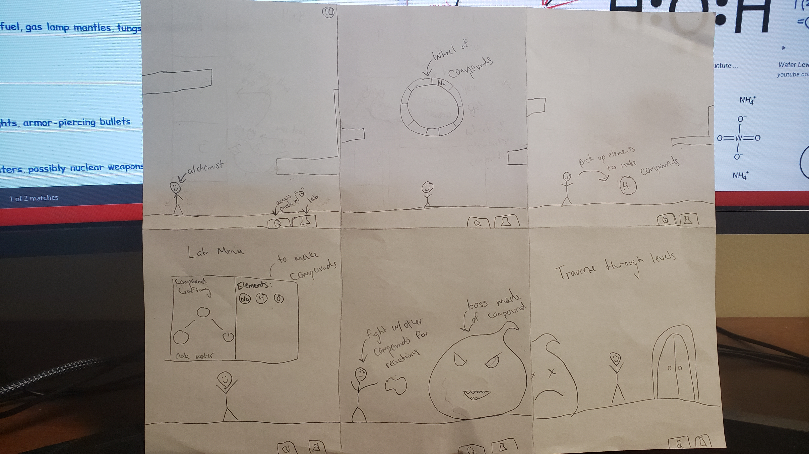

# Lmntor

## Elevator Pitch

*A one sentence pitch for your game. Pretend that your were pitching your game to a executive going to the elevator. You have less than 60 Seconds. Check [this resource](http://www.gameacademy.com/perfecting-indie-games-elevator-pitch/) for more information.*

You are an alchemist who finds recipes for compounds while traversing a dungeon/ platform environment. You use these recipes to create new spells or compounds used to fight the boss at the end of the level. You also need to collect the compound that will act as a key to get to the next level. Once you have defeated the boss, you can use the compounds you have collected in order to fight enemies on later levels. 

## Influences (Brief)

- *Influence #1*:
  - Medium: Chemistry
  - Explanation: We both struggled with chemistry so this is our way of learning a little bit
- *Influence #2*:
  - Medium: Mario
  - Explanation: Classic platformer that everybody knows and enjoys, we want it to be fun 

## Core Gameplay Mechanics (Brief)

*Give a very high-level description of any core gameplay mechanics*

- *Gameplay Mechanic #1*: Move up, down, left, right
- *Gameplay Mechanic #2*: attack using spells
- *Gameplay Mechanic #3*: collecting recipes
- *Gameplay Mechanic #4*: switching the compound in use

# Learning Aspects

## Learning Domains

*Briefly list any and all of the disciplines and learning domains for this subject.*

Chemistry - learn the formulas for chemical compounds and their effects.

## Target Audiences

*Who are your learners?*
Anyone who wants to learn a basic understanding of chemical compounds

## Target Contexts

*Describe what kinds of formal and informal learning contexts this will be used in (e.g., courses, k-12 computer labs during free time).*

This can be played at any point during a students free time or during class in order to teach problems in the domains we have chosen

## Learning Objectives

*Remember, Learning Objectives are NOT simply topics. They are statements of observable behavior that a learner can do after the learning experience. You cannot observe someone "understanding" or "knowing" something.*

- *Formal Learning Objective #1*: By the end of instruction, players will be able to construct compounds using elements provided
- *Formal Learning Objective #2*: By the end of instruction, players will be able to identify the compound based on the structure 

## Prerequisite Knowledge

*What do they need to know prior to trying this game?*

- *Prerequisite Learning Objective #1*: Basic understanding of some elements from the periodic table.

## Assessment Measures

*Describe how the learning will be assessed, e.g., pre/post multiple-choice test, or SAT, or some other instrument.*
Will be measured by showing the number of correct and incorrect answers (scoreboard)

# What sets this project apart?

*Give some reasons why this game is not like every other game out there. Whether the learning objective is unique, the gameplay mechanics are new, or what. You should persuade the reader that your game is novel and worthy of development. Consider arguments that would be persuasive to a Venture Capitalist, Teacher, or Researcher. These might be focused on learning needs, too.*

- *Reason #1*: Platformer with a puzzle that teaches chemistry

# Player Interaction Patterns and Modes

## Player Interaction Pattern

*Describe how people play your game, how many players are involved at once, how they interact with the system works, etc.*

Our game is a single player game where the player interacts with the world by traversing it and locating tools that will assist them in completing the stage. 
## Player Modes

*Your game has one or more player modes. Describe each discrete mode, considering things like menus too. Generally describe the transitions between modes too.*

- There will be a main menu at the start of the game and the player will be able to choose a mode to play. There will be no transitions since the player just picks one and plays.
  - *Player mode #1*:  Story Mode - classic story mode that gets more difficult as it progresses.

# Gameplay Objectives
- *Primary Objective #1*: Collect elements
    - Description: *Player collects the elements that are spread across the current level*
    - Alignment: LO 1
 *Primary Objective #2*: Form compound
    - Description: *Use the right amount of collected elements to form a certain compound*
    - Alignment: LOs 2
 *Primary Objective #3*: Defeat the boss
    - Description: *Defeat the boss by using previously formed compounds*
    - Alignment: LOs 1,2
# Procedures/Actions

*Describe the control scheme and what actions a user can take in the game.*

The user can move around the map using WASD or the arrow keys and shoot with the spacebar or mouse. The user can also access their lab/inventory using “I” or “L” in which they can utilize the collected elements and form compounds to use as they advance through the level..

# Rules

*What resources are available to the player that they make use of?  How does this affect gameplay? How are these resources finite?*

- There will be a finite amount of elements spread throughout the level which the player must collect.
- The player will have a recipe book in which a recipe for previously formed compounds will be stored.
- There will be some sort of hint on the level that will guide the player into forming certain compounds.

# Objects/Entities

*What other things are in the world that you need to design? These may or may not directly translate to actual objects and classes.*

- There is a player that moves throughout the level
- There will be various elements that need to be spread across each level
- There will be a recipe book that will store formulas
- There will be a enemies of certain elements/compounds that react different to incoming attacks
- There will be bosses that will also react differently to incoming attacks based on the compound

## Core Gameplay Mechanics (Detailed)

- Controlling the main character*: You move the character using the assigned keys throughout the map
- Collecting elements: Pick up elements spread across the level
- Use single elements: Use single elements to aid you in your journey. Example, neon would light up a dark map
- Form a compound: Using the collected elements, form a compound in the lab/inventory
- Defeat enemies: Attack enemies using an attack based on the element/compound they’re weak against
- Defeating the boss: Use your knowledge and compound from previous levels, defeat the boss with different attacks.
    
## Feedback

*Explicitly describe what visual/audio/animation indicators there are that give players feedback on their progress towards their gameplay objectives (and ideally the learning objectives).*

When fighting enemies, they will react to an attack from the player based on what kind of enemy it is. For example, if you fight a water enemy and you attack them with the water compound, they will get bigger. This can be expanded further with different enemy types and each element/compound will have different effects.  

*Describe what longer-term feedback you detect and give that guides the player in their learning and lets them know how they are doing in regards to the learning objectives.*

As the player advances in the game, they will acquire more compound recipes and the knowledge to make them which ties in directly with learning objective 1. They will also remember how to defeat certain enemies by creating a reaction that will clear a path to the boss(learning objective 2).

# Story and Gameplay

## Presentation of Rules

*Briefly describe how the player will learn the gameplay mechanics. Avoid using walls of text, since people will not read them. Think instead of natural ways of teaching mechanics iteratively and slowly.*

The first level will act as a tutorial stage where the player will be prompted to collect certain elements and a recipe in order to defeat the boss. There will be no smaller enemies in order to allow the player to fully understand what they are doing, however they will fight a boss at the end of the level to understand how making the compound can assist them in the future. 

## Presentation of Content

*Briefly describe how the player will be taught the core material they are meant to learn. Avoid using walls of text, since people will not read them. Think instead of natural ways of teaching material iteratively and slowly.*

The player will collect elements scattered across the level and learn to use them individually or form compounds by combining them. They will be provided hints on which elements to use to form certain compounds. Their knowledge will be tested by them having to form compounds on their own prior to a boss fight and by the interactions their attacks have with various enemies.

## Story (Brief)

*The Summary or TL;DR version of below*

You are an alchemist using the power of chemistry to fight monsters to collect rare elements. 

## Storyboarding

*Go into as much detail as needs be to visually convey the Dynamics of your game. Be detailed. Create storyboards and freeze frame images that concisely capture important key elements of your game. You are strongly recommended to sketch pictures on paper and embed them here. Be sure make it clear how previously-described mechanics come through in the dynamics.*

Example elements and their uses:
Hydrogen + oxygen2 - combine to make water 
Neon + Glass Tube + Electricity = light up dark room
Helium = reduces gravity on player if used on self or make enemies lighter/float
Molybdenum = used on player to provide defense at the expense of being able to move
Palladium = hydrogen magnet, collects hydrogen from the air
 silver, gold = conduct electricity but most importantly flex with jewelry 

# Assets Needed

## Aesthetics

*Give a sense of the aesthetics of your game, the spirit and atmosphere. Use descriptive, evocative words that can help the reader understand the emotional response of your game.*

The game should have an adventure-like theme that gives the player a sense of discovery and openness, allowing the player to feel free creativity as they progress. As they fight a boss, the game will pick up pace and they will feel a sense of slight urgency, however it should be a fun experience without stress. 

## Graphical

- Characters List
  - *AlKMo - main character
  - Enemies/Boss based on elements
- Textures:
  - Platform levels
- Environment Art/Textures:
  - *Background Images*

## Audio

*Game region/phase/time are ways of designating a particularly important place in the game.*

- Music List (Ambient sound)
  - *Background Music*: *Netherplace*
  - *Boss Music*: *Crimson Balrog (Maple Story)*
  
*Game Interactions are things that trigger SFX, like character movement, hitting a spiky enemy, collecting a coin.*

- Sound List (SFX)
  - *Collect element*: *pick up sound*
  - *Use skill/element*: *sound effect based on skill*
  - *Combine elements*: *sound effect based on compound*
  - *Hit monster*: *some sort of hit sound*
  - *Jump*: *jump sound effect*
  - *Take damage*: *hurt sound effect*

# Metadata

* Template created by Austin Cory Bart <acbart@udel.edu>, Mark Sheriff, Alec Markarian, and Benjamin Stanley.
* Version 0.0.3